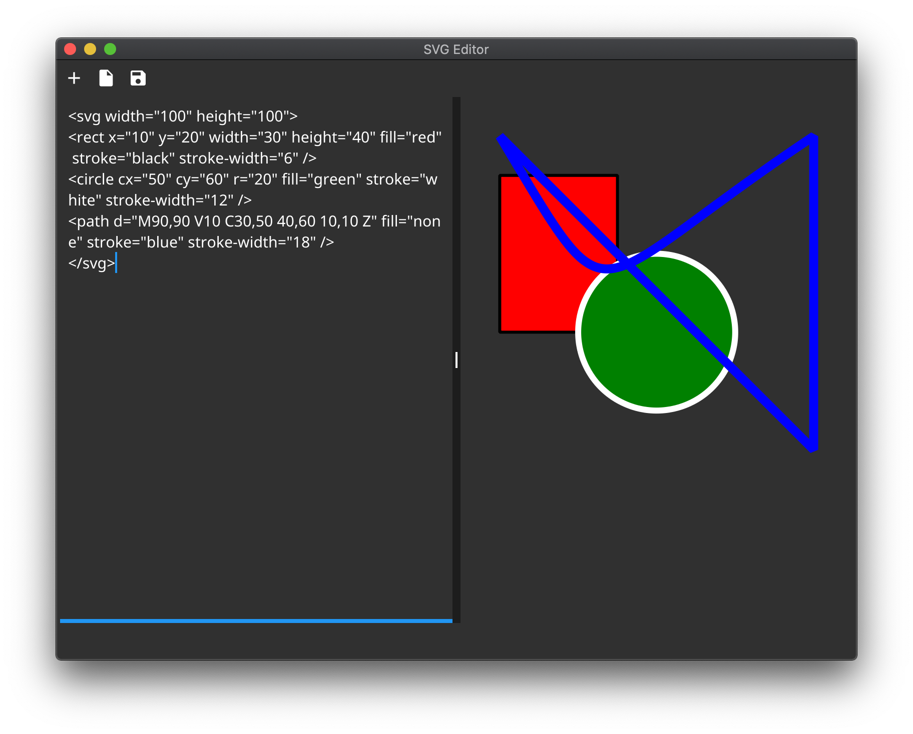
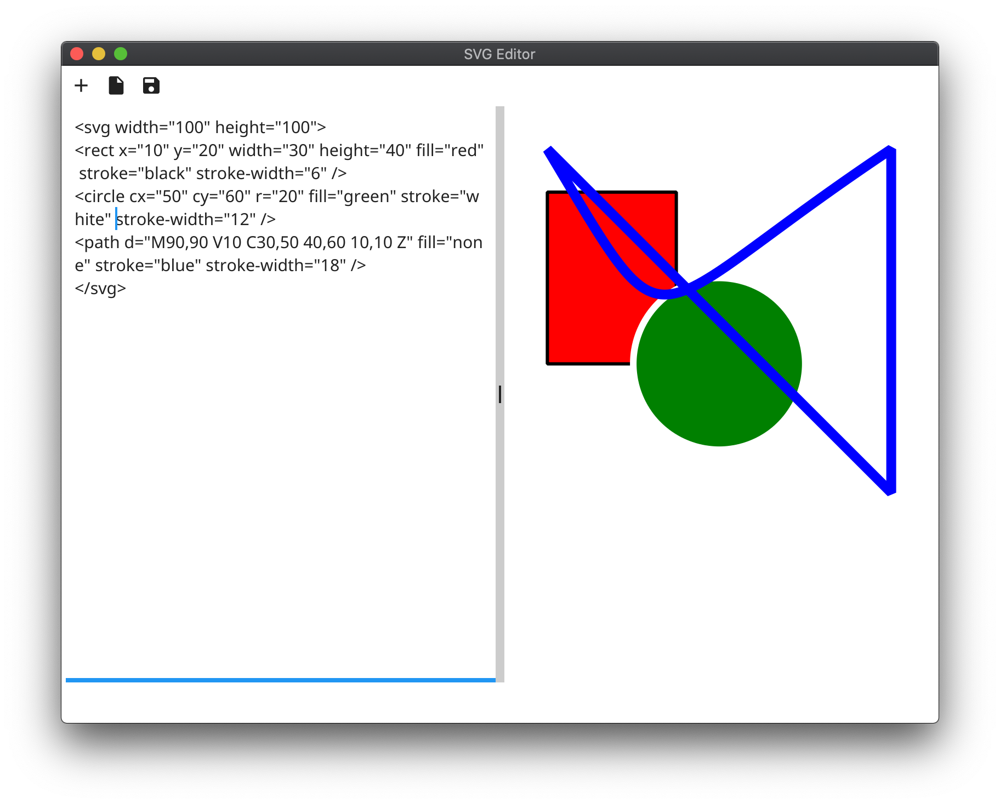

SVG Editor
==========

A cross-platform SVG Editor.





Built with [Fyne](https://fyne.io), [rasterx](https://github.com/srwiley/rasterx), and [oksvg](https://github.com/srwiley/oksvg)

### Usage
```sh
go get -u github.com/stuartmscott/svge
svge
```
